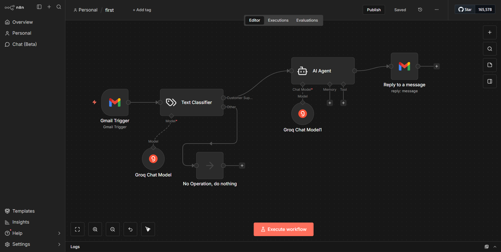
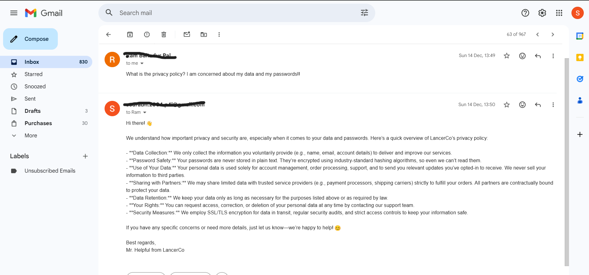

# ai-email-support-automation-n8n
An AI-powered email automation built with n8n that classifies incoming emails using an LLM and sends intelligent, context-aware replies automatically. Customer queries are handled instantly while irrelevant emails are ignored, improving support efficiency and response time.

### Problem
Manually reading, categorizing, and replying to emails is time-consuming and inefficient. Important customer queries can be delayed or missed, especially for startups and small teams managing high email volumes.

### Solution
This automation uses an AI model to classify incoming emails and automatically respond to relevant queries with professional replies, reducing manual effort and improving response time.

### What it does
- Detects incoming emails via Gmail  
- Classifies message intent using AI  
- Generates context-aware replies using an AI Agent  
- Automatically responds to relevant queries  
- Ignores non-actionable or irrelevant emails  

### Tech Stack
- n8n  
- Groq LLM  
- Gmail API  

### Use Case
Automated customer support for startups, solo founders, and service-based businesses.

## Workflow Overview

### Email Classification & Auto Reply Flow

### Automated Email Reply Example

